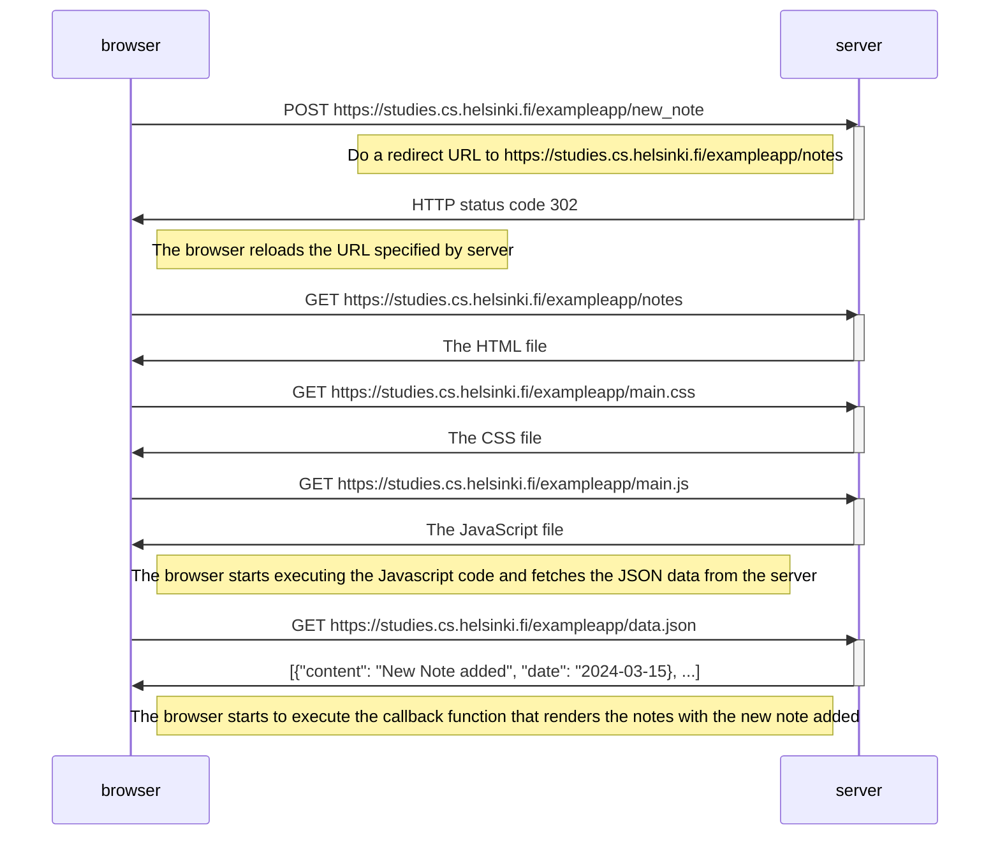

```mermaid
sequenceDiagram
  participant browser
  participant server

  browser->>server: POST https://studies.cs.helsinki.fi/exampleapp/new_note
  activate server
  Note left of server: Do a redirect URL to https://studies.cs.helsinki.fi/exampleapp/notes
  server->>browser: HTTP status code 302
  deactivate server

  Note right of browser: The browser reloads the URL specified by server

  browser->>server: GET https://studies.cs.helsinki.fi/exampleapp/notes
  activate server
  server->>browser: The HTML file
  deactivate server

  browser->>server: GET https://studies.cs.helsinki.fi/exampleapp/main.css
  activate server
  server->>browser: The CSS file
  deactivate server

  browser->>server: GET https://studies.cs.helsinki.fi/exampleapp/main.js
  activate server
  server->>browser: The JavaScript file
  deactivate server

  Note right of browser: The browser starts executing the Javascript code and fetches the JSON data from the server

  browser->>server: GET https://studies.cs.helsinki.fi/exampleapp/data.json
  activate server
  server->>browser: [{"content": "New Note added", "date": "2024-03-15}, ...]
  deactivate server

  Note right of browser: The browser starts to execute the callback function that renders the notes with the new note added

```
