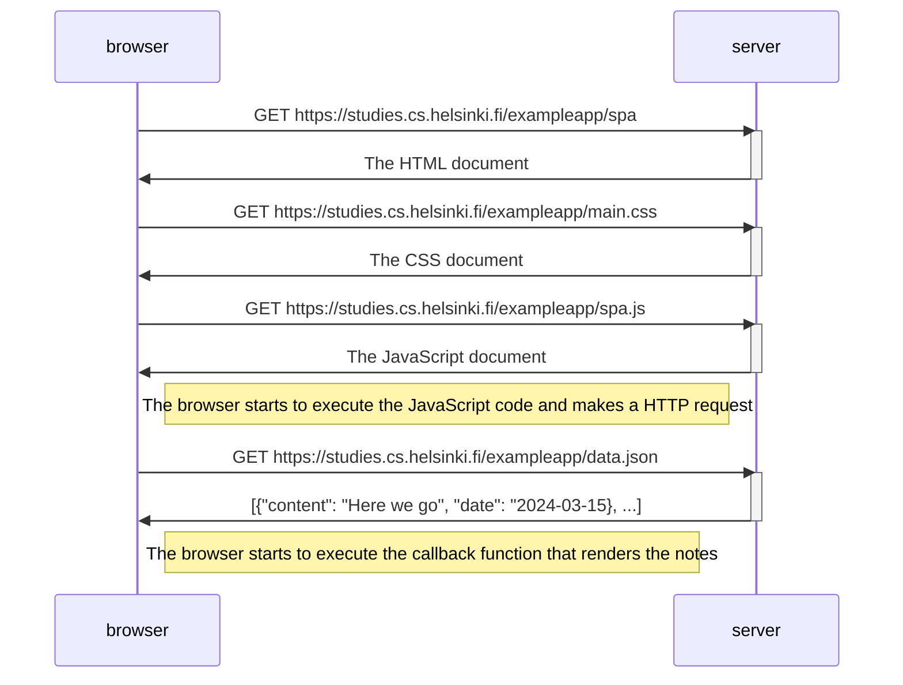

```mermaid
sequenceDiagram
  participant browser
  participant server
  
  browser->>server: GET https://studies.cs.helsinki.fi/exampleapp/spa
  activate server
  server->>browser: The HTML document
  deactivate server

  browser->>server: GET https://studies.cs.helsinki.fi/exampleapp/main.css
  activate server
  server->>browser: The CSS document
  deactivate server

  browser->>server: GET https://studies.cs.helsinki.fi/exampleapp/spa.js
  activate server
  server->>browser: The JavaScript document
  deactivate server

  Note right of browser: The browser starts to execute the JavaScript code and makes a HTTP request

  browser->>server: GET https://studies.cs.helsinki.fi/exampleapp/data.json
  activate server
  server->>browser: [{"content": "Here we go", "date": "2024-03-15}, ...]
  deactivate server

  Note right of browser: The browser starts to execute the callback function that renders the notes

```